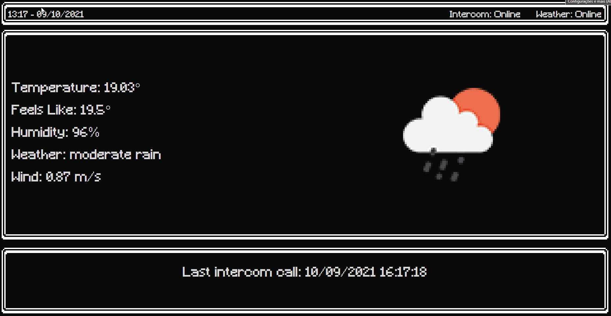

# PixelDesk
Pixel Art Stylized SPA (kiosk) with weather info and integration with IOT for intercom alarm, use MQTT messages: [MQTT](https://mqtt.org/)
Integration with Open Weather Map for weather forecast: [Open weather map](https://openweathermap.org/)
For more details and examples of IOT devices see [HARIA](https://github.com/Kelvysb/HARIA) project



# Installation

Designed for docker container deploy.

[Docker Compose Release](https://github.com/Kelvysb/PixelDesk/releases/download/v3.0/Release_3_0.zip)

[Docker Repository](https://hub.docker.com/repository/docker/kelvysb/pixeldesk)


1 - Edit or create the .env file:
```
MQTT_SERVER=<MQTT Server>
MQTT_USER=<MQTT User>
MQTT_PASSWORD=<MQTT password>
MQTT_INTERCOM_TOPIC=<target intercom topic on MQTT>
MQTT_VALUE_JPATH=<Jpath to retrieve boolean value for intercom>
OW_URL=https://api.openweathermap.org/data/2.5/weather
OW_APIKEY=<Open weather map api key>
OW_LATITUDE=<Your location latitude>
OW_LONGITUDE=<Your location longitude>
```

MQTT config:
`
MQTT_INTERCOM_TOPIC=devices/SA001/state
`

MQTT_VALUE_JPATH: 
considering the following message on intercom topic:
```json
{
    "device_id": "SA001",
    "device_name": "sensor array 1",
    "sensors": {
        "d0": { "value": false, "description": "Intercom" },
        "d1": { "value": false, "description": "Hall" },
        "d2": { "value": false, "description": "Kitchen" },
        "d3": { "value": false, "description": "Dinner" },
        "d4": { "value": false, "description": "Tv" },
        "d5": { "value": false, "description": "Service" },
        "d6": { "value": false, "description": "Balcony" },
        "d7": { "value": true, "description": "Door" },
        "d8": { "value": false, "description": "Lock" },
        "a0": { "value": 2.25586, "description": "Temperature" }
    },
    "datetime": "2021-10-09T16:24:40Z"
}
```

`MQTT_VALUE_JPATH=$..sensors.d0.value`

2 - Run the following command on the same folder as `docker-compose.yml` and `.env` files:

Linux:
`sudo docker-compose up -d`

Windows:
`docker-compose up -d`


